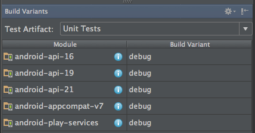
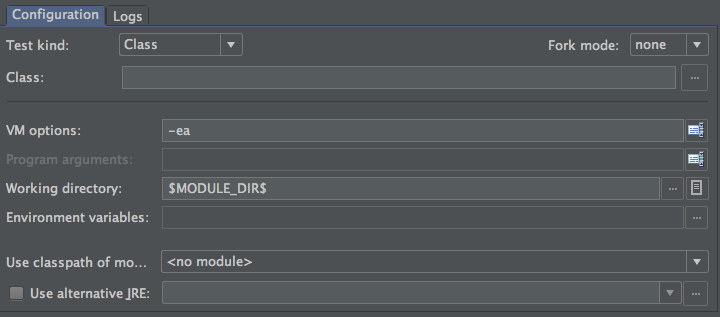

## Android Studio + Gradle (AGP < 3.0)

In earlier versions you must specify the `constants` field which points to the `BuildConfig.class` generated by Gradle. Robolectric uses the constants in the class to compute the output paths used by Gradle when building your project. Without these values, Robolectric will not be able to find your merged manifest, resources, or assets. This will cease to work in the future so we strongly recommend migrating to the new API.

```groovy
testCompile "org.robolectric:robolectric:{{ robolectric.version.current_patched }}"
```

Annotate your test with the Robolectric test runner and configure Robolectric to find your resources.

```java
@RunWith(RobolectricTestRunner.class)
@Config(constants = BuildConfig.class)
public class SandwichTest {
}
```
### Building with Android Studio

Robolectric works with Android Studio 1.1.0 or newer. Simply follow the instructions above for working with Gradle. For versions of Android Studio older than 2.0.0, enable the unit test support in the "Build Variants" tab and run your test. As of Android Studio 2.0.0, the test artifacts feature is enabled by default, and the setting to enable/disable test artifacts can be found in File Menu -> Settings -> Build, Execution, Deployment -> Build Tools -> Gradle -> Experimental.



### Updating JUnit run configurations

You will probably also need to configure the default JUnit test runner configuration in order to work around a bug where Android Studio does not set the working directory to the module being tested. This can be accomplished by editing the run configurations, `Defaults -> Android JUnit` and changing the working directory value to `$MODULE_DIR$`.



Note that if you already have existing JUnit configurations (`Android JUnit` in the root of the tree), you must do the same change as described above for all of them.

## Maven & Eclipse

Add the following to your pom.xml:

```xml
<dependency>
   <groupId>org.robolectric</groupId>
   <artifactId>robolectric</artifactId>
   <version>{{ robolectric.version.current_patched }}</version>
   <scope>test</scope>
</dependency>
```

Annotate your test with the base test runner:

```java
@RunWith(RobolectricTestRunner.class)
public class SandwichTest {
}
```

### Using Libraries with Maven

If you use Maven to build your application, you will need to tell Robolectric where the unpacked resources are located for each library you use. This can either be specified in the `@Config` annotation:

```java
@RunWith(RobolectricTestRunner.class)
@Config(libraries = {
    "build/unpacked-libraries/library1",
    "build/unpacked-libraries/library2"
})
public class SandwichTest {
}
```

or specified in the `robolectric.properties` file:

```properties
libraries=build/unpacked-libraries/library1,build/unpacked-libraries/library2
```

All paths are relative to the root directory of the project.

### Debugging Resource Loading Issues

If you are not sure if resources are being loaded for a particular library, enable debug logging by setting the system property `robolectric.logging.enabled = true` and run your tests. You should see lots of output like:

```
Loading resources for 'com.foo' from build/unpacked-libraries/library1...
```

If you don't see a particular library in the list, double-check the configuration.

If you reference resources that are outside of your project (i.e. in an aar dependency), you will need to provide Robolectric with a pointer to the exploded aar in your build system. See the section titled "Using Library Resources" for more information.

### Building with Eclipse

Install the [m2e-android](http://rgladwell.github.io/m2e-android/) plugin for Eclipse, and import the project as a Maven project. After importing into Eclipse, you have to mark the *consume-aar* goal as ignored, since AAR consumption is not yet supported by m2e-android. To do this, simply apply the Quick fix on the "Plugin execution not covered by lifecycle configuration" error. To run your tests, just right click on the project -> *Run as* -> *JUnit Test*, then choose the *Eclipse JUnit Launcher*.
